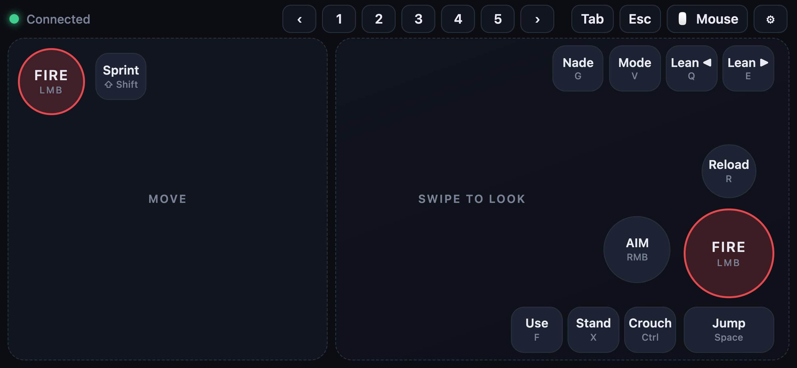
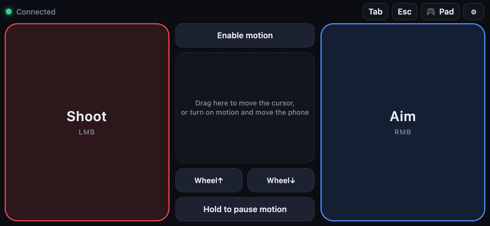
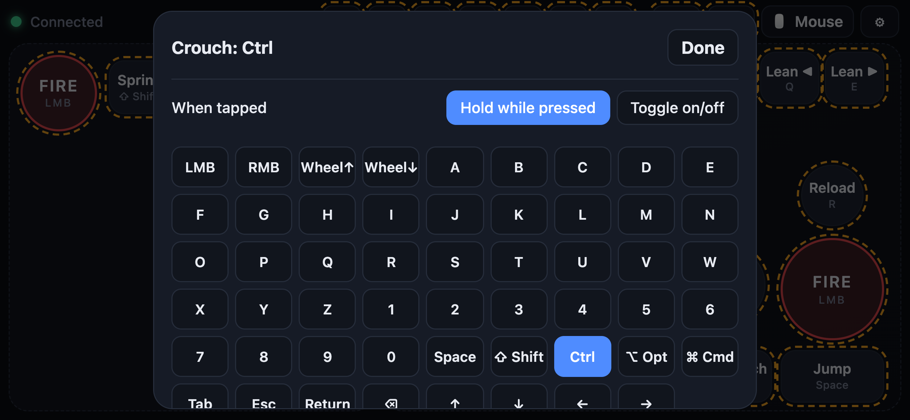
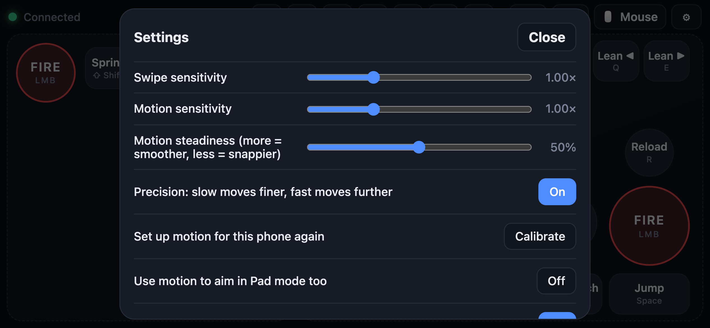
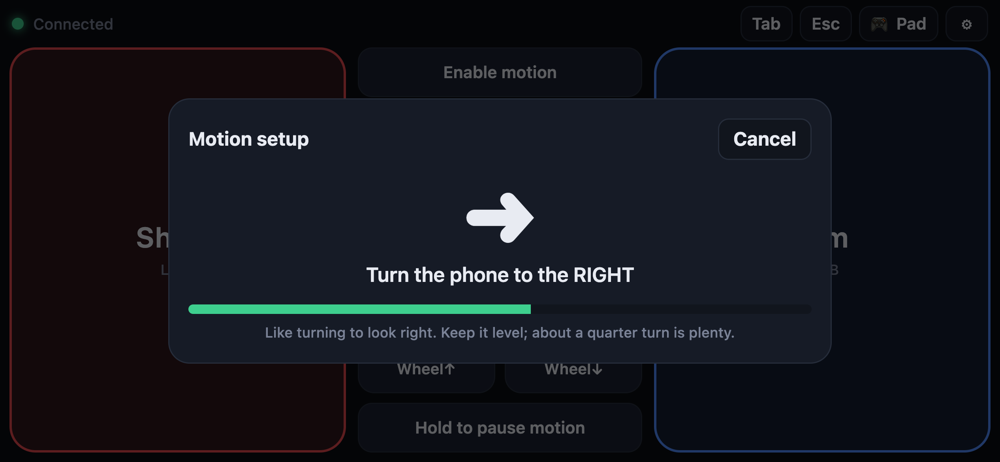
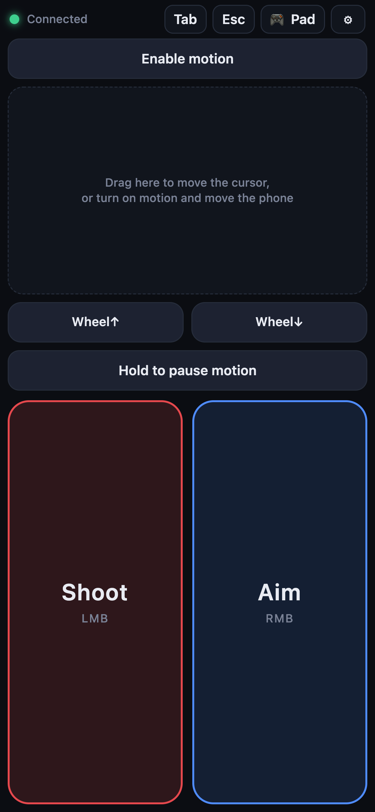
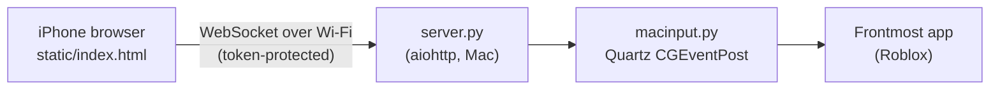
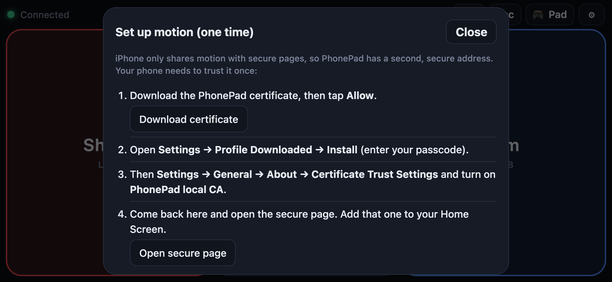

# PhonePad

Turn an iPhone into a game controller for Roblox on a Mac. There's no app to install and no Apple developer account: a small Python server runs on the Mac, the phone opens a controller page in Safari over Wi‑Fi, and the server turns touches into real keyboard and mouse input for whatever game is in front.

The default layout is built for Roblox military shooters, tuned on [The Eastern War 2.5](https://www.roblox.com/games/16740784399). Every button can be remapped from the phone, so it works for other games too.

<p align="center">
  
</p>

## What it does

- **Pad mode.** A floating move stick (W/A/S/D) on the left and a swipe area for aiming on the right. FIRE, AIM, Reload, Jump, Crouch, lean, fire mode, grenade, weapon slots 1–5 and the mouse wheel are all buttons. Drag the FIRE button to aim while you shoot. Push the stick all the way forward to sprint.
- **Mouse mode.** The phone becomes a two-button air mouse: move the phone to move the cursor, with Shoot (left click) and Aim (right click) usable at the same time. It works held sideways with two hands or upright with one, like a TV remote.
- **Remap anything on the phone.** Tap ⚙︎ → Edit buttons, tap a button, pick a key, and choose hold or toggle. Settings are saved on the phone.
- **Plays like a real mouse.** First-person games lock the cursor and read movement deltas. PhonePad sends those deltas and keeps the actual cursor inside the game window, so it never wanders onto the Dock or off the screen mid-fight.
- **Never leaves you stuck walking.** Every held key and button is released if the phone disconnects, goes quiet for 1.5 seconds, or the server stops.

| | |
|---|---|
|  |  |
| Mouse mode, sideways | Remapping a button on the phone |
|  |  |
| Settings | Two-step motion calibration |

<p align="center">
  
  <br><sub>Mouse mode, upright</sub>
</p>

## How it works



The page sends small JSON messages: stick positions, button down/up, and look deltas from swipes or phone motion. The server validates them, keeps track of which keys are held, and only sends changes. A 120 Hz loop turns stick and look input into relative mouse movement, with sub-pixel accumulation so slow aiming stays smooth. Keys go out as macOS virtual key codes, modifiers go out as flag-change events, and mouse moves carry the delta fields that games read when the cursor is locked.

**Motion control** is the hard part. Browsers don't agree on which rotation axis is which, so the two-step calibration (turn right, then tilt up) learns how this phone reports motion. After that:
- Turning left and right is measured around the real vertical, taken from gravity.
- Tilting up and down is measured around the screen's levelled left-right edge.

As a result it works the same whether you hold the phone sideways, upright or tilted back, and twisting it doesn't move the cursor. A One Euro filter smooths out hand shake without adding lag to fast moves. Pointer acceleration makes slow moves finer, and motion is damped for about 0.1 s after each button press so tapping doesn't knock your aim.

**Why there's a certificate:** iPhone Safari only gives motion data to secure (https) pages. PhonePad creates a small local certificate authority on first run and serves a second, secure page on port 8766. The CA is name-constrained to `.local` names and private or local IP ranges, so it can't be used to impersonate real websites. Its private key never leaves `.certs/` on the Mac.

## Requirements

- A Mac (the input side uses macOS Quartz events). Tested on macOS 26 with Python 3.14.
- An iPhone on the same Wi‑Fi. Haptics need iOS 18 or later. Everything else works in any recent iOS Safari.
- Free: no paid accounts, no App Store.

## Quick start

```bash
git clone https://github.com/singha105/phonepad.git
cd phonepad
./start.command
```

The first run creates `.venv` and installs the requirements. If Python 3 is missing, it opens the Command Line Tools installer; run it again afterwards.

1. **Allow Accessibility.** macOS only accepts synthetic input from apps you've allowed. Open System Settings → Privacy & Security → Accessibility, turn on **Terminal**, then restart `start.command`. The server prints a warning while this is missing.
2. **Scan the QR code** printed in Terminal with the iPhone camera. Turn the phone sideways.
3. Optional: Share → **Add to Home Screen** for a full-screen controller.
4. **Click into the Roblox window** on the Mac. Input always goes to the frontmost app.

Keep the Terminal window open while you play (minimised is fine); closing it stops the server.

### Turning on motion (one time)

In Mouse mode, tap **Enable motion** and the page walks you through it:

1. **Download certificate**, then tap Allow (in Safari).
2. On the iPhone: Settings → **Profile Downloaded** → Install.
3. Settings → General → About → **Certificate Trust Settings** → turn on *PhonePad local CA*.
4. Tap **Open secure page**, add that page to your Home Screen, then calibrate: turn the phone right, then tilt it up.

<p align="center">
  
</p>

To remove the certificate later, delete the profile under Settings → General → VPN & Device Management.

## Controls (Pad mode defaults)

| Phone | Sends | Notes |
|---|---|---|
| Move stick (left zone) | W / A / S / D | Full forward also holds Shift to sprint |
| Swipe (right zone) | Mouse movement | Aim and look around |
| FIRE (big, right) | Left mouse | Hold to shoot, drag to aim while shooting |
| FIRE (top left) | Left mouse | For your left thumb |
| AIM | Right mouse | Tap on, tap off |
| Reload / Jump | R / Space | |
| Crouch / Stand | Ctrl / X | Ctrl is crouch in The Eastern War |
| Lean ◀ / Lean ▶ | Q / E | |
| Mode / Nade / Use | V / G / F | Fire mode, grenade, interact |
| Sprint | Shift | Toggle |
| 1–5, ‹ › (top bar) | 1–5, mouse wheel | Weapon slots, previous/next weapon |
| Tab, Esc (top bar) | Tab, Escape | Scoreboard, menu |
| Mouse / Pad (top bar) | | Switch modes |
| ⚙︎ (top bar) | | Sensitivity, motion, vibration, remapping |

The Eastern War doesn't publish its keybinds, so most defaults follow common Roblox military-shooter conventions. Ctrl for crouch was confirmed in the game. If a button does nothing, remap it.

Keys the server accepts: `a`–`z`, `0`–`9`, `space`, `return`, `tab`, `escape`, `backspace`, `left`, `right`, `up`, `down`, `shift`, `control`, `option`, `command`, `mouse_left`, `mouse_right`, `wheel_up`, `wheel_down`. Anything else is ignored. The defaults live in `DEFAULTS` at the top of the script in `static/index.html`.

## Server options

Pass these to `start.command` or `server.py`:

| Flag | Default | What it does |
|---|---|---|
| `--port` | 8765 | Port for the controller page; the secure page uses the next one |
| `--look-sens` | 2.0 | Mac pixels per phone pixel of swipe (phone-side sliders multiply this) |
| `--threshold` | 0.35 | How far to push the move stick before W/A/S/D kick in |
| `--edge` | `recenter` | At the window edge, jump the cursor back to the centre, or `clamp` to stop there |
| `--invert-y` | off | Invert vertical look |
| `--no-https` | | Don't run the secure page |
| `--new-token` | | Make a new pairing token; old links stop working |
| `--dry-run` | | Print input events instead of sending them |

## Security

- **Pairing token:** the phone needs the random token from the QR link, compared in constant time. Wrong tokens get a 403. It's stored in `.token`; `--new-token` replaces it.
- **One phone at a time:** a new phone takes over and the old one is told so (close code 4000).
- **Input validation:** stick values are clamped to the unit circle, swipe deltas are size-limited, non-finite numbers and unknown keys are dropped, and messages over 1 KB are ignored.
- **Logging:** `phonepad.log` records connections, button names and page requests, never the token. It resets itself past 2 MB.
- `.token`, `.certs/` and the log are git-ignored.

## Troubleshooting

**The page doesn't load on the phone.** Check the phone and Mac are on the same Wi‑Fi and the Terminal window is still open. Old Home Screen icons stop working when the Mac's address changes, so scan the new QR code. Chrome on iPhone needs Settings → Apps → Chrome → Local Network turned on. Public and campus Wi‑Fi often blocks devices from talking to each other; use the iPhone's Personal Hotspot instead.

**Buttons light up but nothing happens in the game.** Accessibility isn't granted to Terminal (or the server wasn't restarted after granting it), or the game window isn't in front. Every button press is logged to `phonepad.log`, so you can check whether it reached the Mac. If it did, the game uses a different key; remap it.

**"Enable motion" keeps showing the setup steps.** You're on the normal page; use the secure one (step 4 above). If the secure page won't connect, the certificate isn't trusted yet (step 3).

**Motion goes the wrong way or feels off.** Recalibrate (⚙︎ → Calibrate) with a level turn and a clean tilt. Raise *Motion steadiness* for less shake, or turn *Precision* off if slow moves feel sluggish.

## Tests

```bash
.venv/bin/python tests/test_dryrun.py
```

This runs a `--dry-run` server and drives it over real WebSockets: 27 checks covering pairing, sticks, swipe-look, the mouse wheel, the 60 ms minimum press, junk input, the 1.5 s safety release, phone takeover, disconnects, and the HTTPS side (certificate, iPhone profile, secure WebSocket with both clicks held). The motion maths was checked separately with a simulated phone rotating in 3D under both axis conventions.

## Project layout

```
server.py          aiohttp server: pairing, validation, key tracking, 120 Hz mouse loop, HTTPS
macinput.py        Quartz keyboard/mouse/wheel events, cursor kept in the game window, dry-run backend
certs.py           local name-constrained CA and server certificate for the secure page
static/index.html  the whole phone UI in one file, no external resources
start.command      launcher: creates .venv on first run, then starts the server
tests/             end-to-end dry-run test
docs/screenshots/  the images above
```

## Limitations

- The Mac side is macOS only.
- The game has to be the frontmost window.
- Safari can't keep the screen awake on the plain-http page. Use the secure page, or set a longer Auto-Lock while playing.
- Motion was verified with a simulator and the browser, not across many iPhone models.

## License

MIT. See [LICENSE](LICENSE). Roblox and The Eastern War are trademarks of their respective owners; this project is not affiliated with them.
